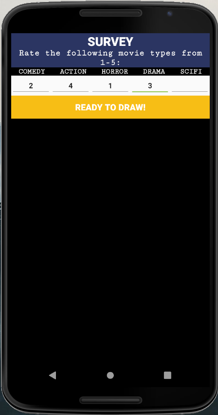
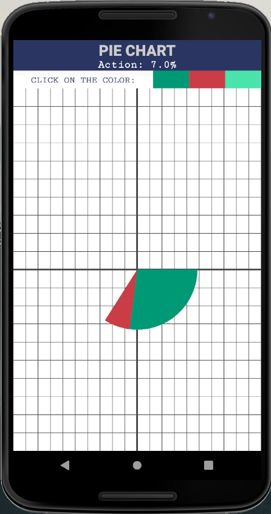
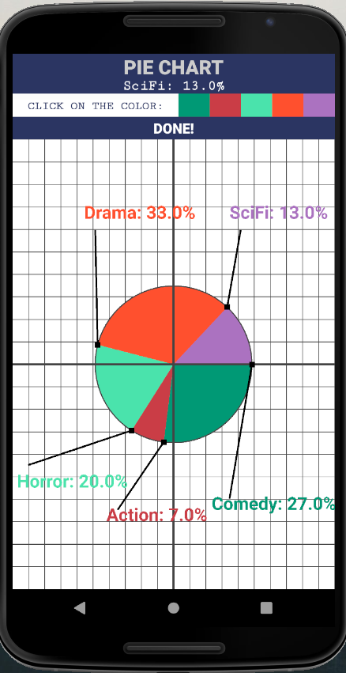

# Project 2

Project 2

Description: This application is a pie chart constructor based on results from a survey question. It begins with prompting the user to answer a survey question. The user must rate the presented movie categories from 1-5 (with 5 being the most-favorable), then click the "Ready to Draw!" button for the grid layout. Next, the user will be able to click the color presented to view the corresponding movie category's weight on the chart, and place it on the grid. After, the all the categories are placed on the grid, the user will prompted to click the "Done!" button to view the final version with labels, and percentages included!

Step 1: Rate the presented movie categories from 1-5, with 5 being the most favorable:

Step 2: Click "Ready to Draw!" to view the grid layout. This will change the above app layout to the one below. The second banner will display the category name and the percentage that it corresponds to on the pie chart. THe user can click on the color to view the corresponding pie slice on the grid.

Step 3: After all the colored pie slices are placed on the grid, the "Done!" button will appear. Click the button to view the final view as shown below. The view consists of labels and starting points for each piece on the chart!

